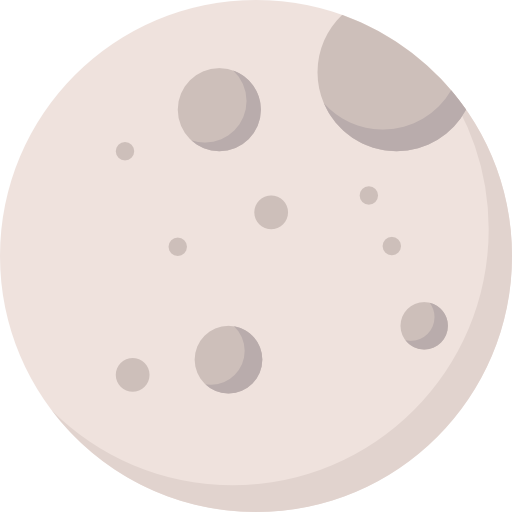

La Lune est le seul satellite naturel de la Terre.

Icone créée par [monkik](https://www.flaticon.com/authors/monkik) trouvée sur [flaticon](https ://www.flaticon.com/

## Caractéristiques

- Masse : 7,3437x1022 kg
- Diamètre : 2500 km
- Symboles : 
    - premier quartier : ☽
    - dernier quartier : ☾
    - pleine lune : 〇
    - nouvelle lune : ● 
